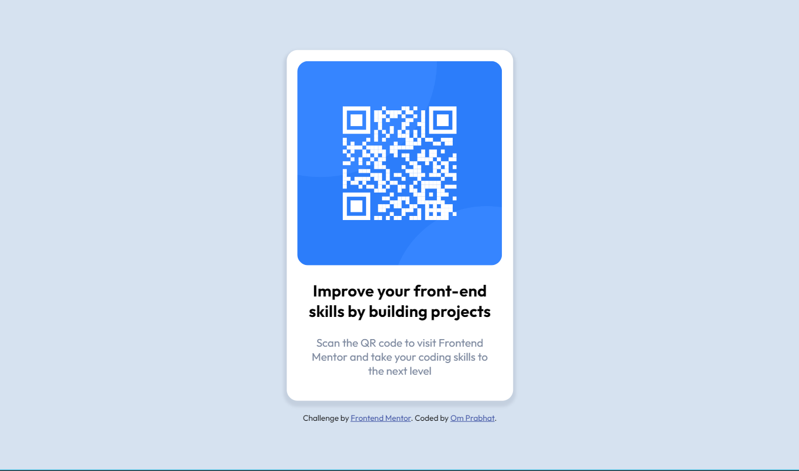

# Frontend Mentor - QR code component solution

This is a solution to the [QR code component challenge on Frontend Mentor](https://www.frontendmentor.io/challenges/qr-code-component-iux_sIO_H). Frontend Mentor challenges help you improve your coding skills by building realistic projects. 

## Table of contents

- [Overview](#overview)
  - [Screenshot](#screenshot)
  - [Links](#links)
- [Author](#author)
- [Acknowledgments](#acknowledgments)

**Note: Delete this note and update the table of contents based on what sections you keep.**

## Overview

### Screenshot

### Links

- Solution URL: 
- Live Site URL: 

## Author

- Website - [Om Prabhat](https://www.your-site.com)
- Frontend Mentor - [@om-prabhat](https://www.frontendmentor.io/profile/om-prabhat)
- Instagram - [@om__prabhat](https://www.instagram.com/om__prabhat/)

## Acknowledgments

I specially want to thank Frontend Menteor for giving me oppurtunity to learn something new by creating something and also I want to thank MDN Reference for helping me a lot.
